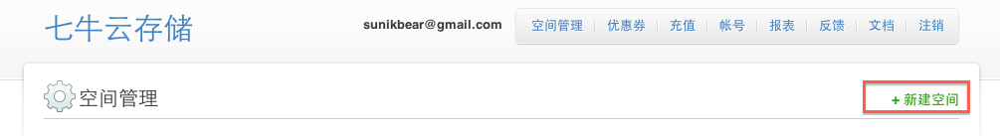
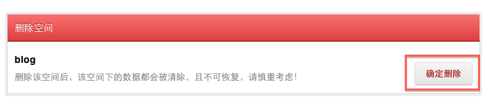
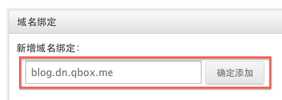
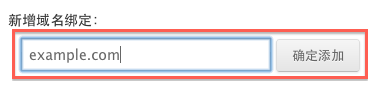
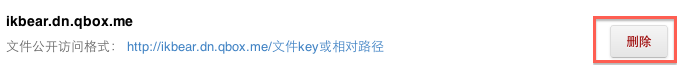

# 七牛云存储常见问题

## 一、概念篇  

1. 七牛云存储是什么？有什么用处？

	七牛云存储是一个专注于为企业提供优秀的云存储服务的公司。七牛云存储的使命是为企业提供安全、可靠、方便且快速的数据存储服务。开发者使用七牛云存储提供的API，即可存储和管理海量非结构化数据（文件），而无需自己管理额外的存储服务器，也无需关心底层细节的变化。

2. 七牛云存储能为我解决什么问题？
	
	* ####节省成本：
	
		七牛云存储为客户提供按需付费的方式，客户使用了多少空间和流量，就为这些空间和流量付费。并且，七牛云存储提供的存储空间和流量是无限制的。因此，使用七牛的云存储服务，开发者用户不仅无需维护自己的存储服务器，更无需按照峰值流量和存储空间来配置服务器的带宽，即可获得超过自身流量和存储空间峰值的存储服务器，但只需为实际使用量付费。
	
	* ####海量存储：
	
		在数据越来越多的时代，海量存储是多数开发者无法回避的问题之一。七牛云存储能够为开发者提供海量的数据存储服务。
		
	* ####专注：
	
		虽然每个开发者都能够通过一定的积累掌握海量存储的技术，但并不是每个开发者都要重复造轮子。把存储服务交给专业的公司做，让自己专注于业务开发，专注于为用户提供最好的业务服务。
		
	* ####加速：
	
		通过优化用户数据的上传和下载方式，以及与国内和国外优秀的CDN加速服务提供商合作，七牛云存储服务能够让您的用户快速访问您存储在七牛服务器上的资源。

3. 七牛云存储和其他云存储相比有什么优势？

4. 七牛云存储如何保证数据安全性？

	用户上传的文件至少存放于3台不同的服务器，并置于不同机房，使得数据安全毫无隐患。独特的存储自备份机制，在任何一台发生服务器故障时，都会在另一台服务器上自我修复一份新数据。
	
	详细的数据安全策略请参考：[http://qiniutek.com/product/security/](http://qiniutek.com/product/security/)

## 二、计费篇

1. 七牛云存储如何收费？价格怎样？
	
	空间和流量按需收费。

2. 是否提供试用，如何申请试用，试用周期多长？
	
	提供试用，试用时间长达3个月，试用期间免费。
	
3. 如何查询账单？
	
	登入七牛云存储开发者中心，可查看[交易记录](#https://dev.qiniutek.com/account/recharge)以及[用户使用报表](#https://dev.qiniutek.com/report)
	
4. 如何获取发票？

## 三、使用篇

### 文件上传

1. 七牛云存储可以存储哪些数据？

	七牛云存储主要存储以文件的形式存在的非结构化数据，如视频和音频文件、图片、PDF和Word文档等。

2. 是否限制单个文件大小？

	

3. 如何上传文件到七牛云存储？

	您可以调用七牛云存储提供的API在服务端将文件上传到七牛云存储服务器，也可以让您的用户直接将数据上传到七牛的服务器而无需经过您的业务服务器。

### AccessKey/SecretKey

1. 什么是密钥（AccessKey/SecretKey）？密钥的作用是什么？
	
	密钥是一个`ACCESS_KEY/SECRET_KEY`对，`ACCESS_KEY`用于标识客户方的身份，在网络请求中会以某种形式进行传输，`SECRET_KEY`作为私钥形式存放于客户方本地并不在网络中传递，`SECRET_KEY`的作用是对于客户方发起的具体请求进行数字签名，用以保证该请求是来自指定的客户方并且请求本身是合法有效的。使用`ACCESS_KEY`进行身份识别，加上`SECRET_KEY`进行数字签名，即可完成应用接入与认证授权。
	
2. 如何获取和保护密钥？

	您可以通过如下步骤获得`ACCESS_KEY`和`SECRET_KEY`：

	* [开通七牛开发者帐号](#https://dev.qiniutek.com/signup)

	* [登录七牛开发者自助平台，查看ACCESS_KEY和SECRET_KEY](#https://dev.qiniutek.com/account/keys)

	有了密钥之后，您就可以顺利的接入云存储，因此，从账户的安全性考虑，请妥善保管密钥，不要将其泄漏给他人。同时，为了保护账户的安全性，七牛云存储为您提供了"主/从"密钥的机制：一个帐号最多拥有两对Access/Secret Key，第1对为主密钥，第2对为从密钥。主密钥不能直接删除，从密钥可以；从密钥删除后，可以新增一对主密钥，原旧的主密钥降格为从密钥。出于安全考虑，建议您周期性地删除从密钥并创建使用新的密钥。

### Bucket

1. 什么是空间（Bucket）？有何作用？

	空间（Bucket）是一个文件存储的集合，在七牛的云存储服务器上映射为一个包含多个资源的表名，其中每个资源为用户上传的文件。空间（Bucket）的作用在于让您根据业务需求独立管理数据。
	
2. 如何创建空间？

	
	
	如上图所示，您可以在七牛开发者中心的后台[手动创建空间](＃https://dev.qiniutek.com/buckets/new)，也可以通过七牛云存储提供的API来[创建空间](#http://docs.qiniutek.com/v3/api/io/#mkbucket)。
	
3. 我可以创建多少个空间？

	您可以创建无限多个空间。
	
4. 每个空间提供多大配额？
	
	每个空间提供的存储容量配额和流量配额不限，但是只收取已使用资源的费用。
	
5. 我应该如何使用空间？

	空间创建好后，您可以根据[七牛云存储提供的API](#http://docs.qiniutek.com/v3/api/io/)来使用空间。
	
6. 如何删除空间？

	
	
	如上图所示，您可以在七牛开发者中心的后台[手动删除空间](＃https://dev.qiniutek.com/buckets/)，也可以通过七牛云存储提供的API来[删除空间](#http://docs.qiniutek.com/v3/api/io/#drop)。

### 文件外链

1. 如何为空间绑定域名，为文件提供URL链接访问？

	
	
	如上图所示，如果您创建的空间名为 "blog" ，缺省情况下，您可以绑定一个七牛云存储提供的子域名 "blog.dn.qbox.me"。如果该子域名被别的用户占用，也可以为该空间绑定另一个子域名，如 "blog2.dn.qbox.me"。
	
	
	
	您也可以为空间绑定自定义域名如 "example.com"，只需在 "example.com" 这个域名的 DNS 管理平台添加一条指向 "iovip.qbox.me" 的 CNAME 记录。使用自定义域名，需要您将此域名备案号和企业营业执照信息发送到 support@qiniutek.com 进行备案。
	
	一个bucket可以绑定多个域名，只要所绑定的域名不相互冲突。域名绑定完之后，您就可以以公开外链的形式访问该域名下的资源。
		
2. 如何自定义处理 404 Not Found ？

	当您[绑定域名创建公开外链](#http://docs.qiniutek.com/v3/api/io/#publish)后，若公开的外链找不到该文件，即可使用您上传的“自定义404文件”，以应对HTTP 404出错的情况。
	
	为此，您只须在名为 action 的表单域中将 EncodedEntryURI 元素中的 `<Key>` 设置为固定字符串类型的值 `errno-404` 即可

3. 如何解除域名绑定，取消文件URL链接访问？

	如果您不希望公开发布资源，或者换用别的域名，可以删除当前绑定的域名，如下图所示。
	
	
	
### 防盗链

1. 什么是 “防盗链” ？
2. 什么是 “refer 防盗链” ？
3. 如何设置 “防盗链”　？
4. 什么是白名单 / 黑名单？
5. 如何设置白名单或黑名单？
6. 如何关闭取消 “防盗链” ？

### 镜像存储

1. 什么是镜像存储？有什么作用？
2. 如何使用镜像存储？
3. 如何取消镜像存储使用？

### 发布静态网站

1. 什么是静态网站？
2. 如何用七牛云存储发布和更新静态网站？
3. 七牛云存储针对静态资源资源访问是否提供 GZip 压缩输出加速访问？
4. 如何为静态网站自定义 404 Not Found 页面？
5. 如何取消静态网站访问？

### 图像处理

1. 七牛云存储是否提供自定义缩略图处理？如何提供使用？
2. 如何自定义缩略图规格？
3. 如何自定义友好URL风格？
4. 如何给图片打水印？
5. 如何设置原图保护？

### 视频/音频处理

1. 七牛云存储是否支持为上传的视频/音频源文件提供压缩转码处理？
2. 如何使用七牛云存储的视频/音频处理服务？

## 四、工具篇

1. 如何使用命令行工具同步文件到七牛云存储？
2. 有无提供命令行工具辅助开发调试？

## 五、开发篇

1. 七牛云存储服务集群如何架构？
2. Web 网页如何向七牛云存储直传文件？
3. iOS / Android 移动端如何向七牛云存储直传文件？
4. PC / 服务端程序如何向七牛云存储直传文件？